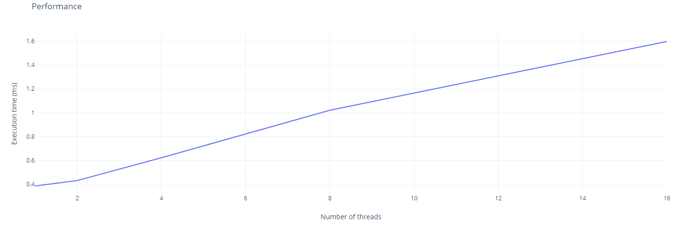
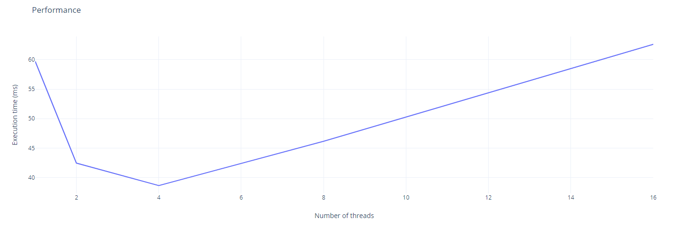
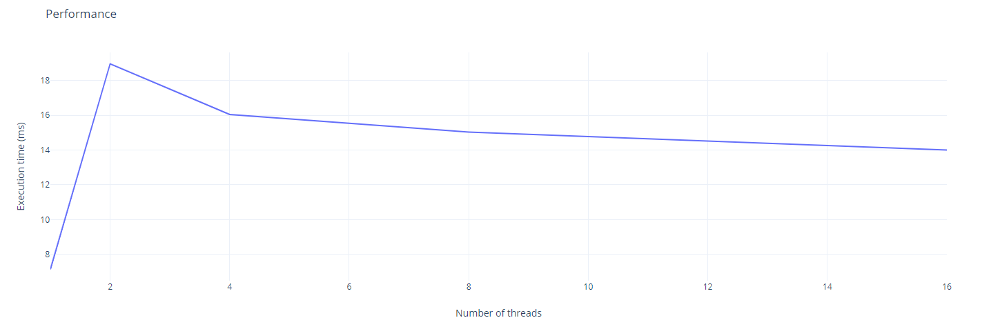
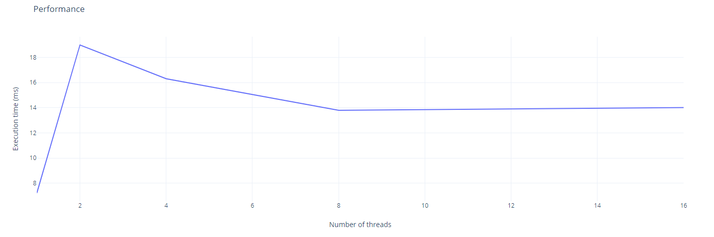

## 1 Java
### Matrice 10x10 cu kernel 3x3

- Pentru o marice de dimensiuni mici timpul de executie creste cu cat adaugam mai multe threaduri

### Matrice 1000x1000 cu kernel 5x5

- Pentru o matrice de dimensiuni mari timpul de executie scade cu cat adaugam mai multe threaduri
- Acest lucru este insa valabil doar pana la 4 theaduri, dupa care timpul de executie incepe sa creasca

### Matrice 10x1000 cu kernel 5x5

- Timpul de executie creste mult pentru 2 threaduri, iar apoi incepe sa scada usor
- Totusi este mai lent decat un singur thread

### Matrice 1000x10 cu kernel 5x5

- Observam ca timpul de executie nu este influentat de forma matricei 10x1000 sau 1000x10
- Este mai degraba influentat de numarul de elemente din matrice

- - - 

C++ alocare statica

### Matrice 10x10 cu kernel 3x3
