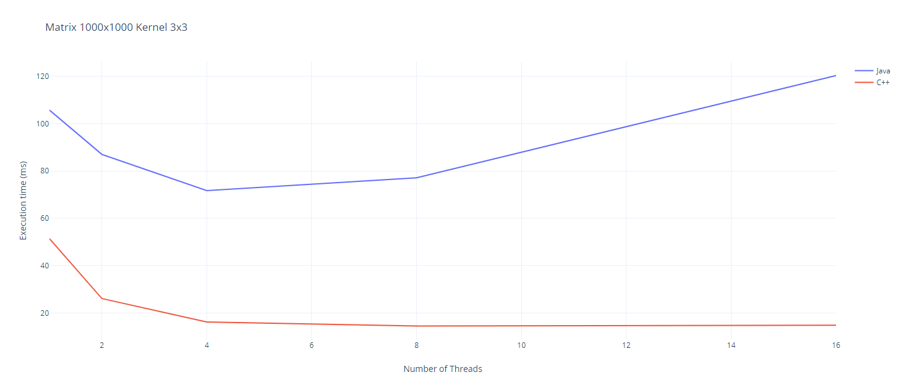
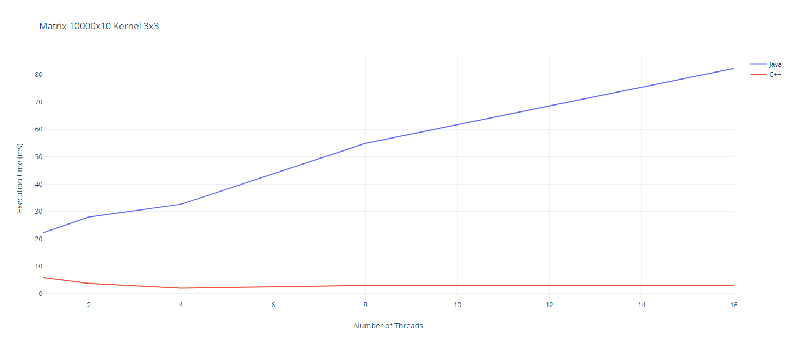
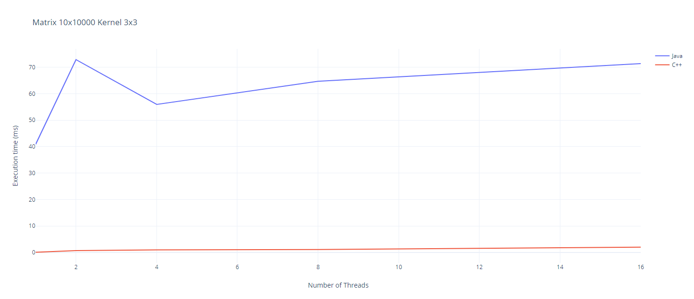

### Grafice

### Matrice 1000x1000 Kernel 5x5

### Matrice 10000x10 Kernel 5x5

### Matrice 10x10000 Kernel 5x5

### Observatii
- Pentru matrici mari timpul de executie scade cu cat adaugam mai multe threaduri
- In cazul Java numarul optim fiind 4 threaduri
- In cazul C++ daca adaugam mai multe theaduri nu imbunatateste timpul de executie, dar nuci nu il creste prea mult
- Pentru matrici mici observam ca adaugarea de theaduri suplimentare creste timpul de executie
- Aceasta crestere este mult mai vizibila in Java decat in C++
- Toate testele au aratat ca C++ este mai rapid decat Java
- 