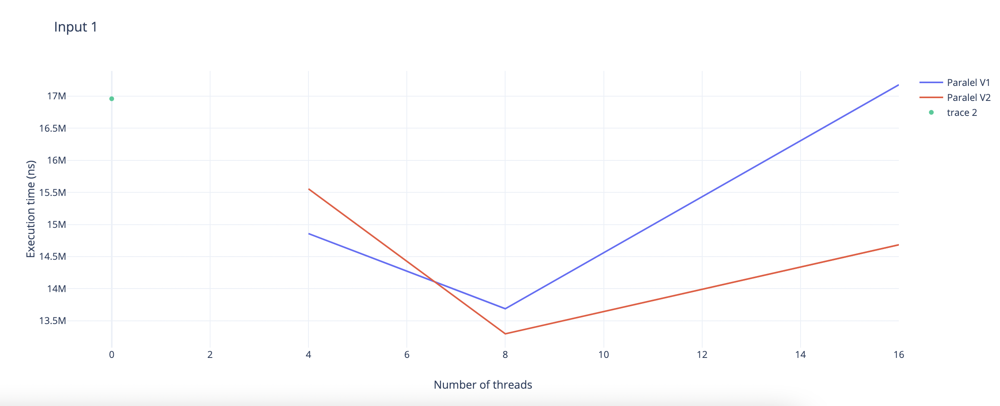
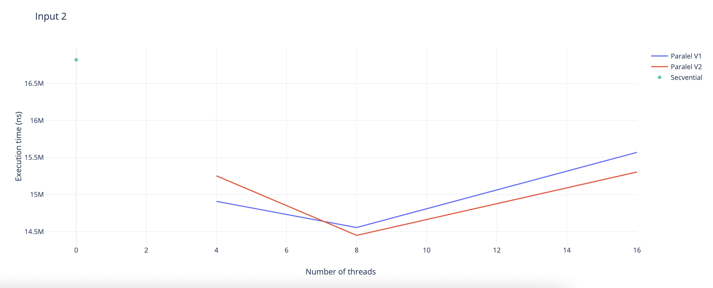
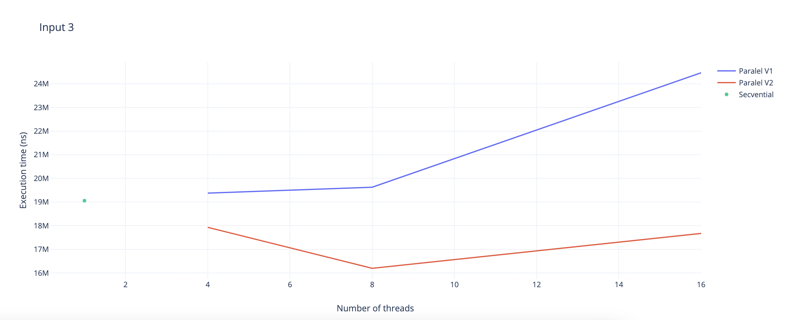

## Laborator L3 - MPI
### Claudiu Neamtu 235

---

## Cerinta

Scrieti un program bazat pe MPI care face suma a 2 numere mari.

‘numar mare’ = numar cu mai mult de 10 cifre

Consideratii generale:

Reprezentare unui numar = tablou de cifre (numere intregi fara semn - byte) in care cifra cea mai nesemnificativa este pe prima pozitie.

Cele 2 numere mari se citesc din fisierele “Numar1.txt” (un numar cu N_1 cifre) si “Numar2.txt” (un numar cu N_2 cifre).

Fiecare din aceste fisiere contine la inceput un numar (N) care reprezinta numarul de cifre si apoi cifrele numarului respectiv.

Implementare -> C++11.

Varianta 0 – implementare secventiala C++11.

Implementari MPI cu p procese:

Varianta 1 – considera rezolvarea problemei prin executia urmatoarelor etape:

1) id_proces_curent=1

2) procesul 0 repeta urmatoarele actiuni pana cand se citesc toate cifrele numerelor

a. citeste cate N/(p-1) cifre din cele 2 fisiere

b. le trimite procesului “id_proces_curent”

c. incrementeaza “id_proces_curent”

3) procesele fac suma cifrelor primite si calculeaza “report” (carry) corespunzator;

4) fiecare proces (cu exceptia ultimului) trimit “reportul” la procesul urmator care il foloseste pentru actualizarea rezultatului (procesul id=1 nu primeste carry - il considera egal 0)

5) rezultatul final se obtine in procesul 0. care scrie rezultatul in fisierul “Numar3.txt”

Posibilitati:

a) procesele primesc carry inainte de a primi cifrele pe care trebuie sa le adune

b) procesele primesc cifrele pe care trebuie sa le adune si apoi carry de la precedent

alegeti pentru implementare varianta care este mai buna!

Optimizare -? Adunarea cifrelor inainte de a astepta carry. Este posibil?

Varianta 2 – considera rezolvarea problemei prin executia urmatoarelor etape:

1) procesul 0 citeste cele 2 numere si le stocheaza in 2 tablouri:

a. daca un numar are mai putine cifre se completeaza cu cifre nesemnificative

2) cifrele celor 2 numere se distribuire proceselor folosind MPI_Scatter (daca nu este valabila conditia p|N, unde N=max{N_1,N_2}, N_1 nr de cifre ale primului numar, N_2 nr de cifre ale celui de-al doilea, atunci se mareste N corespunzator si se completeaza cu 0-uri)

3) procesele fac suma cifrelor primite si calculeaza “report” (carry) corespunzator

4) fiecare process (cu exceptia ultimului) trimit “reportul” la procesul urmator care il foloseste pentru actualizarea rezultatului

5) rezultatul final se obtine in procesul 0 (MPI_Gather)

6) procesul 0 scrie rezultatul in fisierul “Numar3.txt”

- Varianta3– optionala pentru 4 puncte suplimentare! (transmitere asincrona care va produce performanta mai buna) (=> nota 14 pentru laboratorul L3)

Se considera rezolvarea problemei prin executia urmatoarelor etape:

1) id_proces_curent=1

2) procesul 0 repeta urmatoarele actiuni pana cand se citesc toate cifrele numerelor

a. citeste cate N/p cifre din cele 2 fisiere

b. le trimite procesului “id_proces_curent”

c. incrementeaza “id_proces_curent”

3) un process cu id<>0 primeste setul de cifre de la procesul 0 si face adunarea intr-un vector rezultat si actualizeaza “reportul”(carry”) pe care il trimite la procesul urmator

(atentie un proces cu id (id<>1, id<>0) primeste informatie de la procesul 0 si de la procesul (id-1) dar ordinea intre cele 2 nu este sigura … se cere sa se foloseasca MPI_Irecv )

4) rezultatul final se obtine in procesul 0 prin agregarea rezultatelor folosind transmitere asincrona

5) procesul 0 scrie rezultatul in fisierul “Numar3.txt”

Teste pentru fiecare varianta:

1) Numar 1 = “123456789123456789” = Numar2

2) N_1=1000 si N_2=1000 (random digits)

3) N_1=100 si N_2=100000 (random digits)

Numar de Procese: 4, 8, 16

Includeti in timpul de executie si citirea numerelor.

---
## Detalii implementare

- 

---

## Grafice

### Inpput 18 cifre + 18 cifre

### Input 1000 cifre + 1000 cifre

### Input 100 cifre + 100000 cifre

## Observatii

- tipul de executie pentru varianta 2 este mai bun decat varianta 1
- timpul de executie pentru variantele paralele este optim pentru un numar de 8 theaduri
- timpul de executie petru varianta seriala este mai scurt decat varianta paralele

---