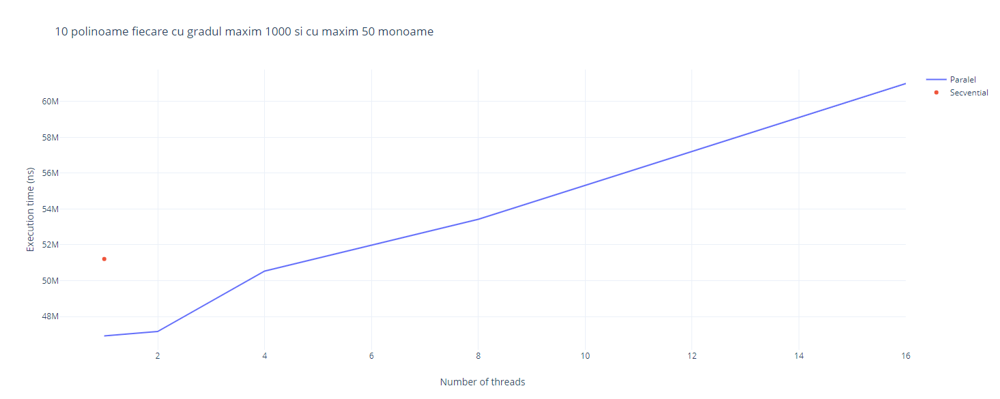
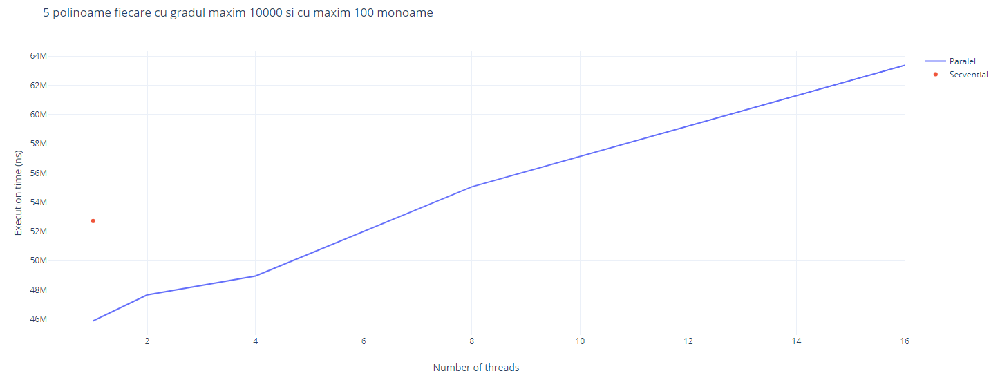

## Laborator 4

### Neamtu Claudiu 235
### 12/12/2022

Obiectiv:

· Intelegerea/aprofundarea sablonului “producator-consumator”

· Intelegerea/aprofundarea sincronizarii conditionale

· Intelegerea/aprofundarea excluderii mutuale (granularitatea sectiunilor critice)

Se considera n polinoame reprezentate prin lista de monoame.

Se cere adunarea polinoamelor folosind o implementare multithreading (p threaduri).

Consideratii generale:

- reprezentarea unui polinom in memorie: lista inlantuita (1 nod=1monom) ordonata dupa exponentii monoamelor cu urmatorul INVARIANT (predicat adevarat la orice moment al executiei) de reprezentare:

-monoamele sunt ordonate dupa exponenti

-nu se pasteaza in lista monoame cu coeficient 0;

- nu exista doua noduri (monoame) cu acelasi exponent

- polinoamele se citesc din fisiere – cate un fisier pentru fiecare polinom;

- un fisier contine informatii de tip (coeficient, exponent) pentru fiecare monom al

unui polinom,

- fisierele input se creeaza prin generare de numere aleatoare.

(Conditie: fisierele nu contin monoame cu coeficient egal cu 0 dar nu sunt ordonate dupa exponent!)

Rezolvare:

Se porneste prin crearea unei liste inlantuita - L corespunzatoare unui polinom nul. In final aceasta lista va continue polinomul rezultat.

Metoda A) Implementare secventiala

· Se citeste pe rand din fiecare fisier cate un monom si se adauga in lista rezultat -L (atentie – invariantul trebuie sa ramana adevarat dupa fiecare adaugare de monom).

Metoda B) Implementare paralela – p threaduri

1. Primul thread citeste cate un monom si il adauga intr-o structura de date de tip coada.

(conditie – pentru structura de tip coada NU se admite folosirea unei structuri de date pentru care partea de sincronizare este deja implementata!!!)

2. Celelalte threaduri preiau cate un monom din coada si il aduna la polinomul reprezentat in lista L.

è Se continua operatiile 1., 2. pana cand toate monoamele, din toate fisierele, sunt adunate la lista L.

3. Primul thread scrie rezultatul obtinut in lista L intr-un fisier rezultat

(conditie: fisierul nu contine monoame cu coefficient egal cu 0)

Productor-consumator

Sincronizare la nivel de lista!!!

Limbaj: la alegere intre Java si C++

Analiza timpului de executie pentru urmatoarele cazuri:

1) 10 polinoame fiecare cu gradul maxim 1000 si cu maxim 50 monoame

a. p = 4, 6, 8

b. secvential

2) 5 polinoame fiecare cu gradul maxim 10000 si cu maxim 100 monoame

a. p = 4, 6, 8

b. secvential

Analiza: raport Tsecvential/Tparalel

### Implementare

#### Varianta secventiala

- se citeste cate un monom din fisier si se adauga in lista de monoame
- se scrie in fisierul rezultat lista de monoame

#### Varianta paralela

- se porneste un thread care citeste cate un monom din fisier si il adauga intr-o coada
- se pornesc p threaduri care preia cate un monom din coada si il adauga in lista de monoame
- lista de monoame este sincronizata la nivel de lista
- lista de monoame si coada sunt blocate cand un thread le acceseaza
- se foloseste o variabila pentru a anunta daca s-a terminat de citit din fisier
- daca s-a terminat de citit din fisier si coada este goala, threadurile worker se opresc
- se asteapta ca toate threadurile sa termine
- se scrie in fisierul rezultat lista de monoame

### Performanta

#### Timp de executie secvential

| Caz  	| Numar threaduri 	| Timp executie (ns) 	|
|------	|-----------------	|--------------------	|
| caz1 	| 1               	| 51210240           	|
| caz2 	| 1               	| 52715010           	|

#### Timp executie paralel
| Caz  	| Numar threaduri 	| Timp executie (ns) 	|
|------	|-----------------	|--------------------	|
| caz1 	| 1               	| 46918650           	|
| caz1 	| 2               	| 47162600           	|
| caz1 	| 4               	| 50536230           	|
| caz1 	| 8               	| 53425240           	|
| caz1 	| 16              	| 61000520           	|
| caz2 	| 1               	| 45880240           	|
| caz2 	| 2               	| 47659820           	|
| caz2 	| 4               	| 48951340           	|
| caz2 	| 8               	| 55055050           	|
| caz2 	| 16              	| 63363820           	|

#### 10 polinoame cu gradul maxim 1000 si cu maxim 50 monoame

---

#### 5 polinoame cu gradul maxim 10000 si cu maxim 100 monoame

---

### Observatii
- pentru 1, 2 sau 4 threaduri, performanta este mai buna pentru varianta paralela decat pentru varianta secventiala
- pentru mai mult de 4 threaduri, performanta este mai rea pentru varianta paralela decat pentru varianta secventiala

### Tsecvential/Tparalel caz 1 

- Tsecvential/Tparalel (1 thread) = 1.09146874431
- Tsecvential/Tparalel (2 thread) = 1.08582308863
- Tsecvential/Tparalel (4 thread) = 1.01333716425
- Tsecvential/Tparalel (8 thread) = 0.9585401956
- Tsecvential/Tparalel (16 thread) = 0.83950497471

### Tsecvential/Tparalel caz 2

- Tsecvential/Tparalel (1 thread) = 1.14896979615
- Tsecvential/Tparalel (2 thread) = 1.08582308863
- Tsecvential/Tparalel (4 thread) = 1.07688594429
- Tsecvential/Tparalel (8 thread) = 0.95749636046
- Tsecvential/Tparalel (16 thread) = 0.83194179265