# Programare Paralela si Distribuita - Lab 1
### Neamtu Claudiu
### 235/1

---

### Cerinta

Se considera o imagine reprezentata printr-o matrice de pixeli, F , de dimensiune (MxN).

Se cere transformarea ei aplicand o filtrare cu o fereastra definita de multimea de indici

Ind[n,m] = {(k,l) | -n/2<=k<=n/2, -m/2<=l<=m/2}

n,m impare si n<N, m<M.

#### Transformarea unui pixel:

V[i,j] = {+ (k,l): -n/2<=k<=n/2, -m/2<=l<=m/2: w[k,l] * F[i-k ,j-l] }

unde

#### De exemplu:

multimea de indici este

`Ind [3,3] ={ (-1,-1), (-1,0), (-1,1), (0,-1), (0,0), (-0,1), (1,-1), (1,0), (1,1)}`

#### Actualizarea unui pixel de pe pozitia (i,j)

`v[i,j] =[i,j] *1/9+ f[i-1,j]* 1/9+ f[i,j-1]* 1/9+ f[i-1,j-1]* 1/9+ f[i+1,j]* 1/9+ f[i,j+1]* 1/9+ f[i+1,j+1]* 1/9`

Pentru frontiere se considera ca un element este egal cu elemental din celula vecina din matrice `f[-1,-1]= f[0,0]; f[-1,j]= f[0,j]; f[i,-1]=f[i,0]; f[M,j]= f[M-1,j]; f[i,N]=f[i,N-1];`

Se cere asigurarea urmatoarei postconditii:

Postconditie: Matricea rezultat V contine imaginea filtrata a imaginii initiale F (unde V != F)

A) Program secvential

B) Program paralel: folositi p threaduri pentru calcul.

Obiectiv: Impartire cat mai echilibrata si eficienta a calculul pe threaduri!

Pentru impartirea sarcinilor de calcul (taskuri) se foloseste descompunere geometrica care poate fi (puteti alege o varianta sau sa incercati mai multe si sa o identificati pe cea mai buna):

- Pe orizontala (mai multe linii alocate unui thread)

- Pe verticala (mai multe coloane alocate unui thread)

- Bloc – submatrici alocate unui thread

- bazat pe o functie de distributie prin care unui index al unui thread i se distribuie o submultime de indecsi din matrice;

distributia se poate face prin:

- distributie liniara (indici alaturati la acelasi thread) sau

- distributie ciclica( cu pas egal cu p).

Implementare:

a) Java

b) C++ ( cel putin C++11 )

i. matricile sunt alocate static (int f[MAX][MAX] )

ii. matricile sunt alocate dynamic (new…)

Folosire directa a threadurilor (creare explicita) => nu se permite folosirea executorilor.

Testare: masurati timpul de executie pentru

1) N=M=10 si n=m=3; p=4;

2) N=M=1000 si n=m=5; p=2,4,8,16

3) N=10 M=10000 si n=m=5; p=2,4,8,16

4) N=10000 M=10 si n=m=5; p=2,4,8,16

Rezultatele acestor teste trebuie sa fie reflectate in documentatie in tabel

---

## Detalii Implementare
- se citeste matricea din fisier
- fiecare thread va primi un interval de linii, de xemplu T1: 0-100, T2: 101-200, T3: 201-300, T4: 301-400
  - aceasta varianta este eficienta cat timp numarul de linii este mai mare decat numarul de threaduri
- fiecare thread va calcula rezultatul pentru intervalul sau
- rezultatul va fi scris intr-o matrice noua
- matricea noua va fi comparata cu matricia obtinuta din programul secvential
- complexitate spatiu: O(2 * N * M)
- bordarea matricii a fost realizata prin adaugarea unor conditii in for-uri

## Experimente

### 1. Java
### Matrice 10x10 cu kernel 3x3
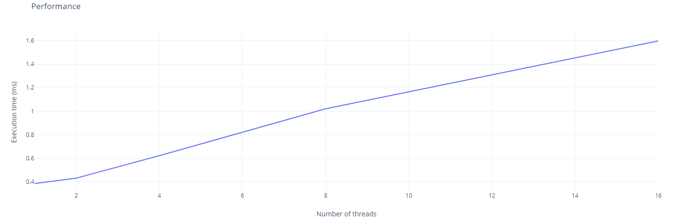
- Pentru o marice de dimensiuni mici timpul de executie creste cu cat adaugam mai multe threaduri

### Matrice 1000x1000 cu kernel 5x5
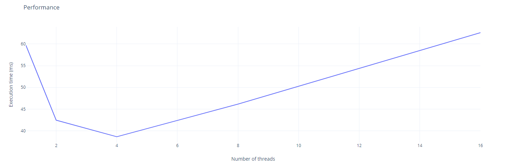
- Pentru o matrice de dimensiuni mari timpul de executie scade cu cat adaugam mai multe threaduri
- Acest lucru este insa valabil doar pana la 4 theaduri, dupa care timpul de executie incepe sa creasca

### Matrice 10x1000 cu kernel 5x5
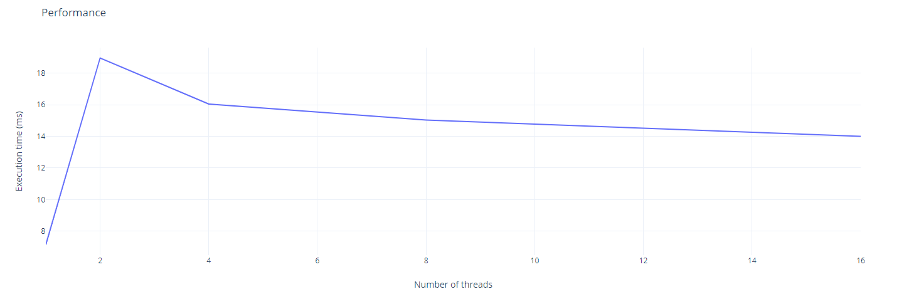
- Timpul de executie creste mult pentru 2 threaduri, iar apoi incepe sa scada usor
- Totusi este mai lent decat un singur thread

### Matrice 1000x10 cu kernel 5x5
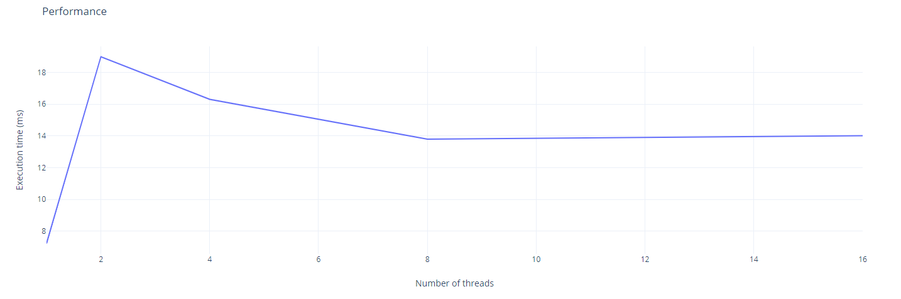
- Observam ca timpul de executie nu este influentat de forma matricei 10x1000 sau 1000x10
- Este mai degraba influentat de numarul de elemente din matrice

- - - 

### 2. C++ alocare statica

### Matrice 10x10 cu kernel 3x3
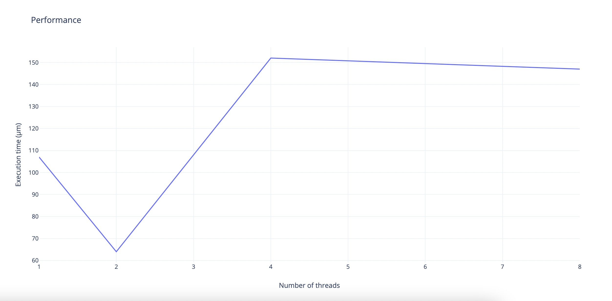
- Nu avem o imbunatatire in timpul de executie daca mai adaugam theaduri

### Matrice 1000x1000 cu kernel 5x5
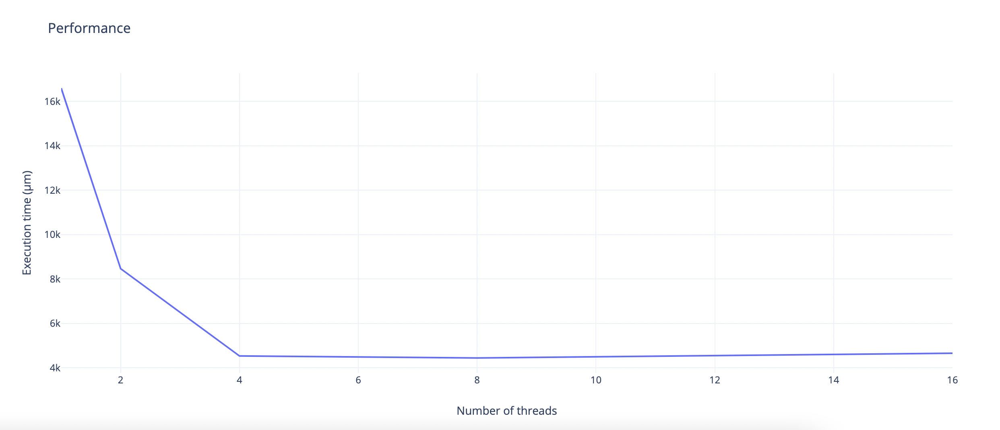
- Observam o imbunatatire in timpul de executie cand crestem numarul de threaduri
- Aceasta imbunatatire este valabila doar pana la un nr de 4 threaduri, dupa timpul de executie incepe sa creasca

### Matrice 10x1000 cu kernel 5x5
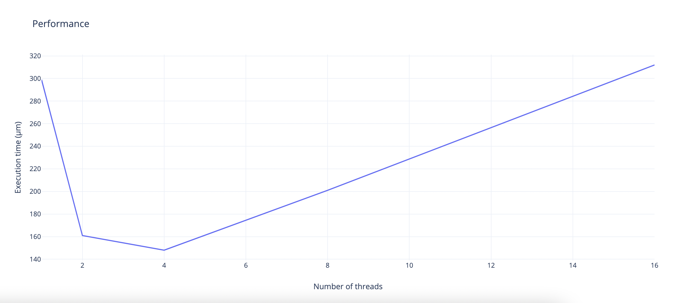
- Timpul de executie scade daca folosim 2 sau 4 threaduri, dar daca folosim mai multe incepe sa creasca iar

### Matrice 1000x10 cu kernel 5x5
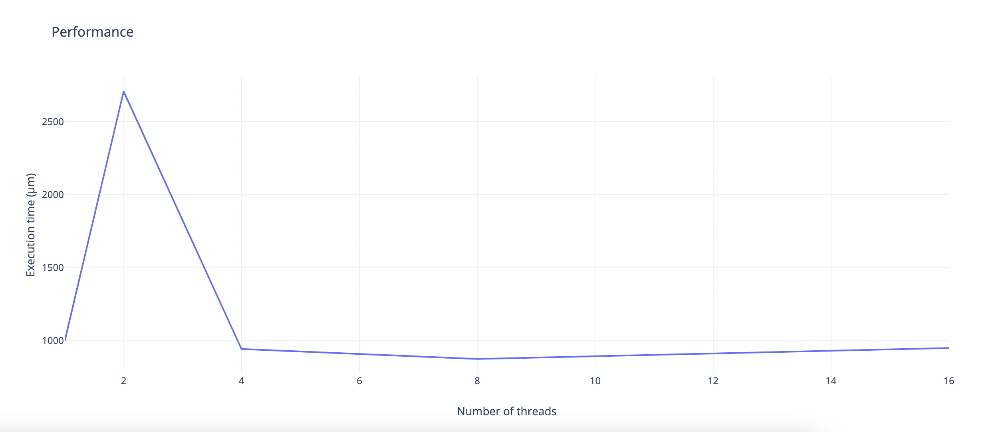
- Timpul de executie nu se imbunatateste daca mai adaugam theaduri
- Din potriva timpul de executie creste foarte mult pentru 2 threaduri

- - -

### 3. C++ alocare dinamica

### Matrice 10x10 cu kernel 3x3
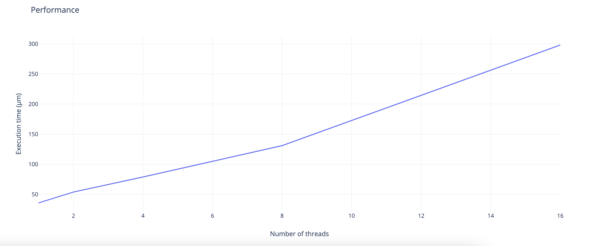
- Timpul de executie nu se imbunatateste daca mai adaugam theaduri

### Matrice 1000x1000 cu kernel 5x5
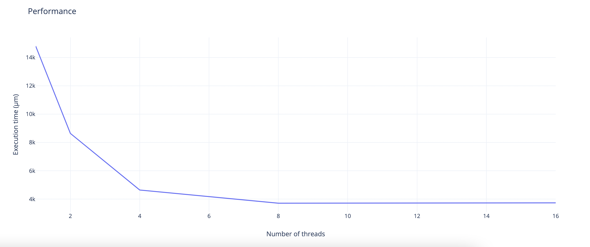
- Timpul de executie se imbunatateste daca mai adaugam theaduri
- Aceasta imbunatatire este valabila doar pana la un nr de 8 threaduri, dupa timpul de executie ramane constant

### Matrice 10x1000 cu kernel 5x5
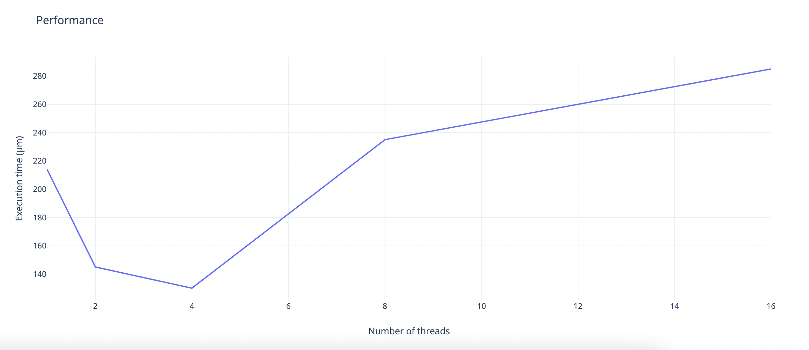
- Timpul de executie scade daca folosim 2 sau 4 threaduri, dar daca folosim mai multe incepe sa creasca iar

### Matrice 1000x10 cu kernel 5x5

- Timpul de executie scade daca folosim 2 sau 4 threaduri, dar daca folosim mai multe incepe sa creasca iar
- Observam performanta nu este influentata de forma matricei 10x1000 sau 1000x10

---

## Concluzii
- Pentru matrici mici, timpul de executie creste cu cat adaugam mai multe threaduri
- Pentru matrici mari, timpul de executie scade cu cat adaugam mai multe threaduri
- Aceasta imbunatatire este valabila doar pana la un nr de 2-4 threaduri, dupa timpul de executie nu se mai imbunatateste semnificativ, iar in unele situatii chiar se inrautateste
- Alocarea dinamica a matricilor nu are niciun efect asupra timpului de executie
- Timpul de executie e mai bun in C++ decat in Java
---
